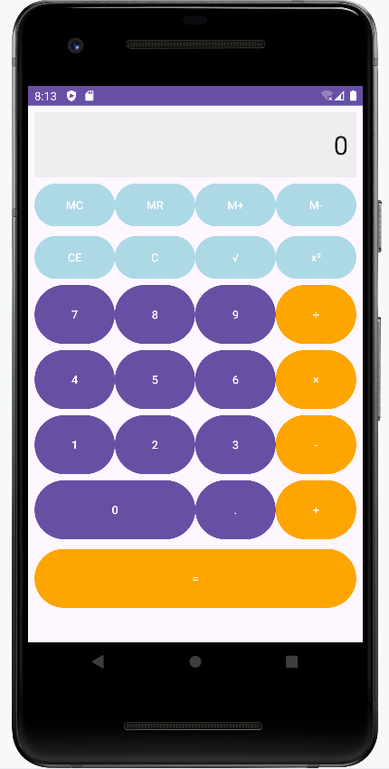

# Basic Android App

This is a Standard Calculator App written for Android target SDK 35, API level 35, Android 15, Vanilla Ice Cream, on Android Studio Merkat 2024.3.2 Patch 1, runtime version 21.0.6, for beginner level demo purposes (I wrote version information in detail to give clearer guidance for the students).

